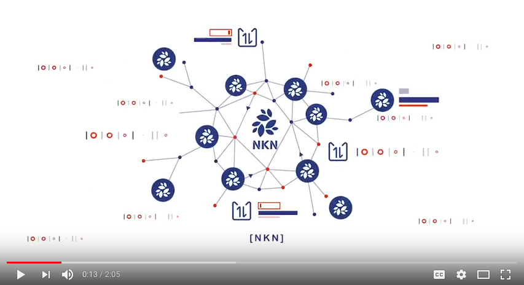

# NKN: a Scalable Self-Evolving and Self-Incentivized Decentralized Network

> A project aiming to rebuild the Internet that will be truly open,
  decentralized, dynamic, safe, shared and owned by the community.

[](https://nkn.org/)

[https://nkn.org/](https://nkn.org/)

Welcome to NKN! Watch a [2-minutes video of NKN
concept](https://youtu.be/cT29i3-ImQk) to get started.

[](https://youtu.be/cT29i3-ImQk)

## Table of Contents

- [Introduction](#introduction)
- [New Kind of Network](#new-kind-of-network)
- [Cellular Automata Powered Consensus](#cellular-automata-powered-consensus)
- [Building](#building)
- [Deployment](#deployment)
- [Contributing](#contributing)
- [Community](#community)

## Introduction

After years of transmutation, the Internet is in danger of losing its
original vision and spirit.  When the FCC approved a measure to remove the
 net neutrality rules by the end of 2017, a demand of ending our reliance on
big telecommunication monopolies and building
decentralized, affordable, locally owned Internet infrastructure becomes ever
stronger. The unrestricted and private Internet access environment is becoming
unsustainable under an endless stream of attacks and blockage, leading to
selective and biased information propagation. Without a proper incentivizing
engagement scheme, it is almost impossible to maintain a constant and secured
 information propagation channel.

NKN intends to revolutionize the entire network technology and business. NKN
 wants  to be the Uber or Airbnb of the trillion-dollar communication service
business, but without a central entity. NKN aspires to free the bits, and build
the Internet we always wanted. By blockchainizing the third and probably the
last pillar of Internet infrastructure,  NKN will revolutionize the blockchain
ecosystem by innovating on the network layer, after Bitcoin and Ethereum
blockchainized computing power as well as IPFS and Filecoin blockchainized
storage. The vision of NKN is not only to revolutionize the decentralized
network layers, but also to develop core technologies for the next generation
blockchain. More details can be found in [Overview](https://github.com/nknorg/nkn/wiki/Technical-Design-Document).

## New Kind of Network

NKN utilizes microscopic rules based on Cellular Automata (CA) to define
network topology, achieves self-evolution behaviors, and explores
Cellular Automata driven consensus, which is fundamentally different
from existing blockchain network layer.CA is a state machine with a collection
of nodes, each changing its state following a local rule that only depends on its
neighbors. Each node only has a few neighbor nodes. Propagating through local
interactions, local states will eventually affect the global behavior of CA.
The desired openness of network is determined by the homogeneity of Cellular
Automata where all nodes are identical, forming a fully decentralized P2P
network. Each node in the NKN network is constantly updating based on its
current state as well as the states of neighbors. The neighbors of each node are
also dynamically changing so that the network topology is also dynamic without
changing its underlying infrastructure and protocols.

NKN introduced the concept of Decentralized Data Transmission Network
(DDTN). DDTN combines multiple independent and self-organized relay
nodes to provide clients with connectivity and data transmission capability.
DDTN provides a variety of strategies for decentralized application (DApp).
In contrast to centralized network connectivity and data transmission, there are
multiple efficient paths between nodes in DDTN, which can be used to enhance
data transmission capacity. Native tokens can incentivize the sharing of network
resources, and eventually minimize wasted connectivity and bandwidth. Such
a property is termed "self-incentivized". More details can be found
in [DDTN](https://github.com/nknorg/nkn/wiki/Tech-Design-Doc%3A-Distributed-Data-Transmission-Network-%28DDTN%29).

## Cellular Automata Powered Consensus

Majority Vote Cellular Automata (MVCA) is a Cellular Automata using
majority vote as updating rule to achieve consensus.Using the mathematical
 framework originally developed for Ising model in physics, we found and
 proved that a class of CA rules will guarantee to reach consensus in at most
O(N) iterations using only states of sparse neighbors by an exact map from
CA to zero temperature Ising model. More details can be found in
[Consensus and Blockchain](https://github.com/nknorg/nkn/wiki/Tech-Design-Doc%3A-Consensus-and-Blockchain).

Consensus in NKN is driven by Proof of Relay (PoR), a useful Proof of
Work (PoW) where the expected rewards a node gets depend on its
network connectivity and data transmission power. PoR is not a
waste of resources since the work performed in PoR benefits the whole network
 by providing more transmission power. The "mining" is redefined as contributing
 to the data transmission layer, and the only way to get more rewards is providing
 more transmission power. The competition between nodes in the network will eventually
drive the system towards the direction of low latency, high bandwidth data transmission network.
More details can be found in [Proof of Relay](https://github.com/nknorg/nkn/wiki/Tech-Design-Doc%3A-Proof-of-Relay-%28PoR%29).

## Building

The requirements to build are:
* Go version 1.8 or later
* Properly configured Go environment

Create directory $GOPATH/src/github.com/nknorg/ if not exists

In directory $GOPATH/src/github.com/nknorg/ clone the repository

```shell
$ git clone https://github.com/nknorg/nkn.git
```

Build the source code with make

```shell
$ cd nkn
$ make glide
$ make vendor
$ make all
```

After building the source code, you should see two executable
programs:

* `nknd`: the nkn program
* `nknc`: command line tool for nkn control

## Deployment

**Note: this repository is in the early development stage and may not
have all functions working properly. It should be used only for testing
now.**

Create several directories to save exectuable files `nknd` `nknc` and
config file `config.json`.

``` shell
$ tree
.
├── n1
│   ├── config.json
│   ├── nknd
│   └── nknc
├── n2
│   ├── config.json
│   ├── nknd
│   └── nknc
├── n3
│   ├── config.json
│   ├── nknd
│   └── nknc
├── n4
│   ├── config.json
│   ├── nknd
│   └── nknc
├── ...
```

Create new wallet in each directory

``` shell
$ ./nknc wallet -c
Password:
Re-enter Password:
Address                            Public Key
-------                            ----------
AbgUvnaiDYbwmKEwSH532W3LPB8Ma2aYYx 0306dd2db26e3cfde2dbe5c8a17ea7c27f13f99c19e2cb59bc13e2d0c41589c7f1
```

Config the same bootstrap node address and public key to each
`config.json` file, for example:

```shell
{
  "Magic": 99281,
  "Version": 1,
  "HttpRestPort": 10663,
  "HttpWsPort":10664,
  "HttpJsonPort": 10665,
  "NodePort": 10666,
  "ChordPort": 10667,
  "PrintLevel": 1,
  "IsTLS": false,
  "ConsensusType": "ising",
  "SeedList": [
    "127.0.0.1:10667"
  ],
  "TestBlockProposer": [
    "0306dd2db26e3cfde2dbe5c8a17ea7c27f13f99c19e2cb59bc13e2d0c41589c7f1"
  ]
}
```

Note that ports in different `config.json` does not need to be different,
conflict in ports will be resolved automatically.

Start bootstrap node by creating a network

```shell
$ ./nknd -test create
Password:
```

Start other nodes by joining the network

```shell
$ ./nknd -test join
Password:
```

## Contributing

Can I contribute patches to NKN project?

Yes! Please open a pull request with signed-off commits. We appreciate
your help!

Please follow our [Golang Style
Guide]https://github.com/nknorg/nkn/wiki/NKN-Golang-Style-Guide)
for coding style.

Please sign off your commit. If you don't sign off your patches, we
will not accept them. This means adding a line that says
"Signed-off-by: Name <email>" at the end of each commit, indicating
that you wrote the code and have the right to pass it on as an open
source patch. This can be done automatically by adding -s when
committing:

```shell
git commit -s
```

## Community

* [Telegram](https://t.me/nknorg)
* [Reddit](https://www.reddit.com/r/nknblockchain/)
* [Twitter](https://twitter.com/NKN_ORG)
* [Facebook](https://www.facebook.com/nkn.org)
